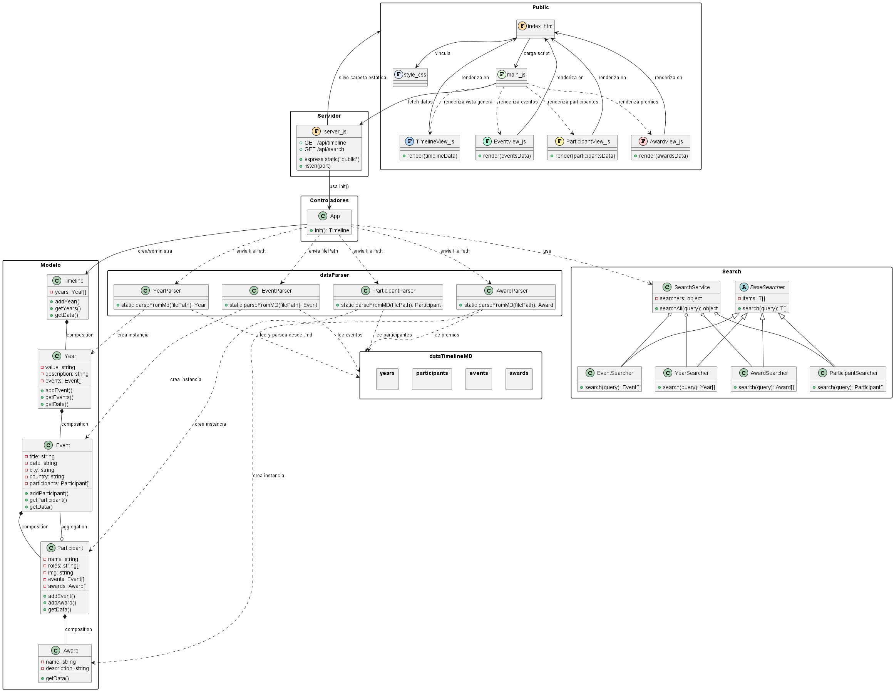

# 🕒 Timeline Dinâmica com Arquivos Markdown

Este projeto foi desenvolvido como **Atividade Extensionista** durante o segundo semestre do curso de Engenharia de Software. O objetivo principal foi construir uma **linha do tempo interativa**, utilizando dados extraídos de arquivos `.md`, aplicando conceitos sólidos de **Programação Orientada a Objetos (POO)**, **arquitetura MVC** e integração entre **front-end e back-end**.

---

## 🧠 Tecnologias e Conceitos Aplicados

- JavaScript moderno (ES6+)
- Programação Orientada a Objetos (POO)
- Arquitetura MVC (Model-View-Controller)
- Manipulação de arquivos Markdown
- Node.js + Express.js (servidor)
- Fetch API
- Testes de integração
- Módulo de busca com serviços especializados (`SearchService`)

---

## 📁 Estrutura do Projeto
/public
├── index.html
├── style.css
├── main.js
├── views/
│ ├── TimelineView.js
│ ├── EventView.js
│ ├── ParticipantView.js
│ └── AwardView.js

/dataTimelineMD
├── years/
├── events/
├── participants/
└── awards/

/dataParser
├── YearParser.js
├── EventParser.js
├── ParticipantParser.js
└── AwardParser.js

/model
├── Timeline.js
├── Year.js
├── Event.js
├── Participant.js
└── Award.js

/controller
└── App.js

/search
├── BaseSearcher.js
├── YearSearcher.js
├── EventSearcher.js
├── ParticipantSearcher.js
├── AwardSearcher.js
└── SearchService.js

server.js

---

## 📐 Arquitetura Geral do Sistema

O sistema é estruturado em camadas bem definidas:

- **Modelo**: Representação das entidades centrais (`Timeline`, `Year`, `Event`, `Participant`, `Award`)
- **Dados**: Arquivos Markdown organizados por categorias
- **Parsers**: Classes responsáveis por transformar os arquivos `.md` em objetos JavaScript
- **Controladores**: Classe `App` que inicializa e conecta os dados
- **Servidor**: `server.js` baseado em Express para servir dados e arquivos estáticos
- **Serviço de Busca**: `SearchService` com buscadores especializados por entidade
- **Público (Front-end)**: Interface construída com HTML, CSS e JavaScript para exibição dos dados

> Consulte o diagrama UML completo do projeto:  
> 

---

## 🚀 Como Executar o Projeto

1. Clone este repositório:
   ```bash
   git clone https://github.com/seu-usuario/timeline-md.git
   cd timeline-md

2. Instale as dependências:
    npm install

3. Instale express:
    npm install express

4. Inicie o servidor:
   node server.js

5. Acesse a aplicação:
   http://localhost:3000


##  🔍 Funcionalidade de Busca

A aplicação permite realizar buscas por:

✅ Anos
✅ Eventos
✅ Participantes
✅ Premiações
As buscas são processadas pelo SearchService, que utiliza buscadores especializados para cada tipo de dado, garantindo resultados precisos e organizados.

## 📚 Licença
Projeto acadêmico desenvolvido exclusivamente para fins educacionais, como parte do curso de Engenharia de Software.
Você está livre para reutilizar, modificar ou expandir este projeto.

## 👩‍💻 Autoria
Desenvolvido por VdSR como parte da Atividade Extensionista do curso de Engenharia de Software.

## 🎥 Capítulos do Curso em Vídeo

- **03:22** – *Resumo com ChatGPT*
- **04:11** – *Justificativa da Atividade Extensionista*
- **05:18** – *Especificação de Requisitos do Software (SRS)*
- **15:02** – *Brainstorming: Estruturação dos Dados*
- **23:10** – *Arquivos Markdown*
- **26:24** – *Modelagem dos Dados*
- **38:11** – *Implementação da Classe Timeline*
- **43:55** – *Implementação da Classe Year*
- **49:17** – *Implementação da Classe Event*
- **55:22** – *Implementação da Classe Participant*
- **58:51** – *Implementação da Classe Award*
- **01:03:10** – *Novo Brainstorming*
- **01:06:23** – *Classe App*
- **01:13:10** – *Classe TimelineView*
- **01:26:47** – *Debugging*
- **01:34:36** – *Renderização de Objetos Hardcoded*
- **01:40:29** – *Nova Estruturação dos Dados*
- **01:51:14** – *Parseadores de Dados (.md → JS)*
- **02:02:14** – *Testes de Integração do Sistema*
- **02:11:54** – *Implementação do Módulo de Busca*
- **02:32:48** – *Conclusão*

https://youtu.be/Ai3ITXtLZ88 
